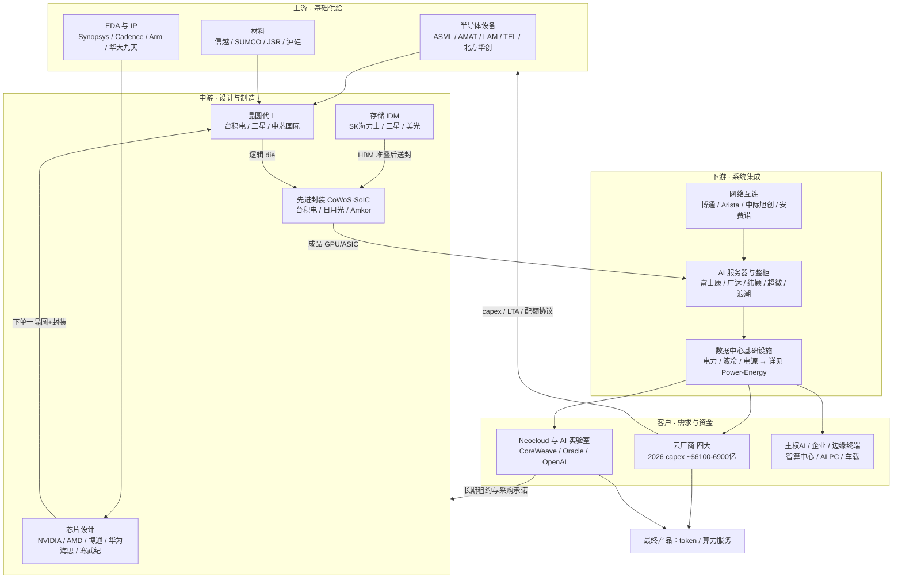

# AI 半导体产业链全景

> 产业链认知框架 v1（2026-09-18 建立）。**本文只搭框架、摆事实，不给投资结论**；结论需要结合 [[Theses/ai-demand-growth|AI 需求论点]]、[[Theses/hbm-cycle|HBM 周期论点]] 单独论证。系统管理的行业跟踪页见 [[Industries/AI-Semiconductor|AI / 半导体]]，电力配套见 [[Industries/Power-Energy|电力 / 电网 / 储能]]。
>
> 文中价格、产能、份额均为**时点数据**（2026 年中前后），标注"据报道/估算"的为第三方口径，未逐一交叉验证。

---

## 0. 阅读框架

本文按八个维度建立产业链：

| 维度 | 回答的问题 | 章节 |
|---|---|---|
| 上游 | 支撑芯片制造的基础工业是什么 | §1 |
| 中游 | 芯片如何被设计、制造、存储、封装 | §2 |
| 下游 | 芯片如何变成可交付的算力系统 | §3 |
| 客户 | 钱从哪里来、付给谁 | §4 |
| 产品 | 链上流动的"货物"是什么形态 | §5 |
| 成本 | 一台 AI 服务器/机柜的钱花在哪 | §6 |
| 供需关系 | 哪些环节紧张、如何出清 | §7 |
| 盈利模式 | 每个环节靠什么赚钱 | §8 |

一句话总纲（框架性描述，非结论）：**AI 半导体产业链是一条把"电力 + 硅 + 稀土/材料"逐级加工成"token"的流水线**——上游提供设备与材料，中游把设计变成硅片上的芯片，下游把芯片组装成机柜和数据中心，客户租用/购买算力，最终向终端用户按 token 收费。产业链的利润分配、瓶颈位置、议价权归属，都围绕"谁的供给最稀缺、谁的替代成本最高"展开。

每个环节统一回答六问：**做什么 / 为什么重要 / 谁购买 / 核心技术 / 行业壁垒 / 当前主要变化**。

---

## 1. 上游：设备、材料、EDA/IP

上游是"造芯片的工业母机"，特点是**寡头垄断 + 全球分工 + 高毛利**，需求由中游资本开支（WFE，晶圆厂设备支出）驱动。2026 年处于 AI 驱动的 WFE 上行周期。

### 1.1 半导体设备（光刻/刻蚀/沉积/量测/离子注入）

- **做什么**：制造晶圆厂里完成"曝光→刻蚀→沉积→清洗→量测"循环的机器。AI 芯片依赖的最关键单机是 EUV 光刻机（7nm 以下必需），先进封装还需要 bonding/混合键合设备。
- **为什么重要**：制程微缩和 CoWoS 扩产的物理瓶颈都在设备上。没有 EUV 就没有 3/2nm，没有键合机就没有 HBM 堆叠和 CoWoS。设备交期直接决定中游扩产节奏。
- **谁购买**：晶圆厂（台积电、三星、中芯、存储三巨头）和先进封装厂。买设备的钱来自资本开支——台积电 2026 年资本开支约 **$560 亿**量级（公司指引）。
- **核心技术**：EUV 光刻（13.5nm 波长、锡等离子体光源、蔡司反射光学；High NA 数值孔径 0.55）；刻蚀/沉积的原子层精度控制（ALD/ACLE）；量测的套刻精度（overlay <1nm）。
- **行业壁垒**：全球唯一性——EUV 只有 ASML 能造（光源蔡司、双工件台 ASML 自研，供应链 5000+ 家）。壁垒是 30 年的工艺数据积累 + 专利 + 客户联合研发锁定，不是单点技术。刻蚀/沉积（AMAT/LAM/TEL/泛林）为 2-3 家寡头格局。
- **当前主要变化**：
  - ASML 将 2026 年收入指引上调至 **€360-400 亿**，2025Q4 单季订单创纪录 **€132 亿**（其中 EUV €74 亿），积压订单约 **€388 亿**；
  - 2026 年计划出货 **60+ 台** EUV；High NA 已在 Intel 18A 节点达到可用里程碑，但台积电据报道暂缓导入 High NA（等 A16 之后的节点）；
  - 国产替代加速：美国出口管制下，中国大陆成为 ASML 最大市场之一的同时，北方华创/中微公司等在刻蚀、沉积环节对国内成熟+先进产线渗透率提升。

### 1.2 半导体材料（硅片/光刻胶/电子特气/CMP/掩模）

- **做什么**：晶圆的"耗材"——硅片是衬底，光刻胶/特气/CMP 浆料是每层工艺的消耗品，先进制程一片晶圆要经历上千道工序、消耗几十种材料。
- **为什么重要**：AI 芯片对材料纯度（ppb 级缺陷控制）和光刻胶分辨率极度敏感；HBM 大量消耗硅片（TSV 工艺使同样 bit 数的晶圆消耗比常规 DRAM 多 2 倍以上），是存储超级周期里被忽视的实物消耗端。
- **谁购买**：晶圆厂和封测厂，按单位消耗持续采购（复购型收入，区别于设备的一次性采购）。
- **核心技术**：大尺寸硅片（12 英寸）无缺陷单晶生长；EUV 光刻胶（金属氧化物体系）；高纯电子特气；先进掩模（EUV 掩模单价 ~$20 万级）。
- **行业壁垒**：认证周期（材料进厂验证 1-2 年起）+ 极低缺陷率know-how + 日本厂商的配方积累。硅片是信越/SUMCO 双寡头（合计 50%+），光刻胶是 JSR/东京应化/信越等日企 90%+。
- **当前主要变化**：HBM/先进制程满产拉动材料放量涨价；日本厂商在高端光刻胶对华出口受限，国产材料（光刻胶、特气）验证导入加快；材料是本轮周期中"涨价传导最慢但持续时间可能最长"的环节。

### 1.3 EDA 工具与 IP 授权

- **做什么**：芯片设计的"软件母机"——Synopsys/Cadence/Siemens EDA 提供逻辑综合、物理验证、仿真工具；ARM 等提供处理器 IP 授权。
- **为什么重要**：没有 EDA 就无法设计十亿级晶体管芯片；先进制程的 PDK（工艺设计套件）与 EDA 工具深度绑定，形成"代工-EDA-设计"铁三角。HBM4 开始引入可定制 base die，设计复杂度进一步向 EDA/IP 倾斜。
- **谁购买**：所有芯片设计公司（NVIDIA/AMD/博通/海思/寒武纪…）和有设计团队的 IDM，按 license + 维护费 + 版税付费。
- **核心技术**：逻辑综合与布局布线算法（与先进制程共同演进）、形式验证、3D-IC/Chiplet 设计工具（为先进封装服务）、AMS 混合信号仿真。
- **行业壁垒**：三巨头合计份额 75%+，工具与工艺数据 30 年共同迭代，客户切换成本极高；新工具需要代工厂认证。对华出口管制使国产 EDA（华大九天等）获得验证窗口，但全流程差距仍在 10 年量级。
- **当前主要变化**：AI 辅助芯片设计（NVIDIA/Google 用 RL 做布线优化）开始反哺工具链；Chiplet/3D 工具成为新增长点；Arm 在 AI 服务器 CPU（NVIDIA Vera、AWS Graviton 均为 Arm 架构）中的版税池扩大。

---

## 2. 中游：设计、代工、存储、封测

中游是产业链的"腰部"，也是本轮 AI 周期利润最集中的地方。分工模式：设计公司（Fabless）下单一台积电（代工），存储三巨头 IDM 自产，HBM 由存储厂堆叠后送台积电 CoWoS 与逻辑芯片合封。

### 2.1 AI 芯片设计（GPU / 自研 ASIC）

- **做什么**：定义芯片架构（张量算力、显存带宽、互连拓扑）并完成设计。两大路线：**通用 GPU**（NVIDIA 为主，AMD MI 系列追赶）和**自研 ASIC**（Google TPU、AWS Trainium、微软 Maia、Meta MTIA、OpenAI "Titan"，设计服务多由博通/Marvell 承担）。
- **为什么重要**：设计环节定义了整个产业链的需求规格——NVIDIA 一家的产品路线图（Blackwell→Rubin）直接决定台积电用什么制程、SK 海力士供多少 HBM、CoWoS 留多少产能。**链主环节，附庸皆随其节奏起舞**。
- **谁购买**：云厂商、AI 实验室（直接或通过整机厂）、企业客户。GPU 按卡/机柜销售（NVIDIA 2026 年季度数据中心收入创纪录，约 $890 亿量级，第三方报道）；ASIC 不外卖，是云厂商"自用"的设计。
- **核心技术**：张量矩阵引擎、大容量高带宽显存接口、NVLink 类Scale-up 互连、Chiplet 架构；软件栈（CUDA）是 NVIDIA 真正的护城河——迁移成本意味着重写整个 AI 生态。
- **行业壁垒**：生态 > 架构 > 制程。CUDA 生态 15 年积累、每代产品与台积电最先进制程+CoWoS 绑定、研发投入（NVIDIA 年研发 $100 亿+）形成正循环。ASIC 路线的壁垒则是"云厂商自己的规模与软件团队"。
- **当前主要变化**：
  - **平台迭代加速**：GB300（Blackwell Ultra，288GB HBM3E）2025 下半年量产爬坡；**Rubin 平台 2026 下半年全面出货**（HBM4、Vera CPU、NVLink 6 3600GB/s、官方口径 token 处理 3.5×于 Blackwell Ultra）；据供应链追踪，2026 年 Rubin 出货量或达 ~570 万颗量级；
  - **ASIC 份额上行**：推理已占 AI 算力需求约 2/3，正适合 ASIC；博通 AI 订单积压 ~$730 亿（目标 2027 年 $1000 亿）；AWS Trainium3 于 2026 年上量并锁定 OpenAI 2GW；Counterpoint 预计 ASIC 出货 2027 年前翻三倍；
  - **NVIDIA 反制开放**：NVLink Fusion 向第三方 CPU/ASIC 半定制芯片开放互连生态；
  - **国产设计突围**：华为昇腾 2025 年出货 81.2 万卡（占国产近半），2026 年 910C 计划翻倍至 ~60 万颗、950PR 规划 ~80 万颗（据报道），路线图到 2028 年的 960/970。

### 2.2 晶圆代工

- **做什么**：把设计公司的版图变成硅片上的芯片。AI 相关的先进制程（N4/N3/N2）+ CoWoS 先进封装几乎都由台积电承担。
- **为什么重要**：**全产业链最窄的物理瓶颈之一**。全球 90%+ 的先进制程（≤5nm）产能集中在台积电；NVIDIA/AMD/博通/苹果排队抢产能，代工分配直接决定谁家有货。
- **谁购买**：Fabless 设计公司（按晶圆+封测付费）、IDM 外包部分。
- **核心技术**：FinFET→GAA（N2 起）晶体管、A16 背面供电、SoIC 混合键合（3D 堆叠）；良率管理（3nm 良率爬升数据是最深的 know-how）。
- **行业壁垒**：$200 亿级单厂资本开支 + 10 年产能爬坡周期 + 良率数据积累；先进制程事实上只剩台积电/三星/Intel 三家，且台积电一家占 2/3+ 份额。三星 2nm 良率与生态落后，Intel 转型代工仍在投入期。
- **当前主要变化**：
  - 台积电 2026 年资本开支 ~$560 亿，N2/A16 产能以每年 ~70% 增速扩张，交期据报道长达 78-156 周；
  - N2 产能基本被订满，部分需求回溢到 N3，带动整体先进制程满载；
  - 中芯国际在成熟+受限先进制程上支撑国产链：据报道 2026 年华为锁定其 ~43% 先进产能、寒武纪 ~11%，15 家国产 AI 芯片公司挤同一产线，"产能船票"成为国产链胜负手；
  - 地缘备份：台积电亚利桑那/日本熊本厂爬坡，但先进制程与 CoWoS 主体仍在台湾。

### 2.3 存储制造（HBM / DRAM / NAND）

- **做什么**：生产 AI 服务器的"内存墙"解药——HBM（高带宽内存，TSV 垂直堆叠 8-16 层 DRAM die）以及常规 DRAM/NAND。SK 海力士/三星/美光三家 IDM 格局。
- **为什么重要**：AI 推理是访存受限（memory-bound）的，HBM 容量×带宽直接决定 GPU 有效算力；**HBM 是当前全链最紧的供给**，SK 海力士 2026 年产能已全部售罄。存储同时是最强周期环节，其价格波动外溢到整个电子产业。
- **谁购买**：GPU/ASIC 设计公司（HBM 随 GPU 合封，实际由台积电在 CoWoS 环节消耗）、服务器 OEM（常规 DRAM/SSD）、消费电子厂。
- **核心技术**：TSV 硅通孔+微凸点堆叠、MR-MUF/TC-NCF 键合工艺（16 层以上堆叠的良率核心）、HBM4 的 base die 逻辑化（2048bit 接口，base die 转由台积电代工，接口开放定制）。
- **行业壁垒**：DRAM 三家 95%+ 份额的寡头格局（20 年淘汰赛的结果）；HBM 良率差距（三星长期过不了 NVIDIA 验证，2026 年才恢复）；堆叠工艺专利。
- **当前主要变化**：
  - **HBM4 放量元年**：SK 海力士独家首发量产，UBS 预计其拿下 Rubin 平台 HBM4 份额 ~70%；美光在 HBM4 供应排名上反超三星；三星产能 +50% 追赶；CES 2026 已展出 16 层 48GB HBM4；
  - **产能挤兑引发全面涨价**：HBM 吞掉 DRAM 产能 → 常规 DRAM 合约价 2026Q1 环比 +93-98%、Q2 再 +58-63%，NAND +70-75%（TrendForce），RAM 价格较 2024 年翻倍，消费电子被动承压；
  - **定价机制变化**：从现货/季度合约转向长期协议（LTA）锁量锁价，存储厂议价权显著增强；SK 海力士/三星向 Stargate 项目承诺 90 万片晶圆；
  - 国产链：华为昇腾 950 起搭配自研 HBM（HiBL 1.0/HiZQ 2.0，官方口径），降低对韩系依赖。

### 2.4 先进封装与测试（CoWoS / OSAT / HBM 封装）

- **做什么**：把逻辑 die + HBM 通过 2.5D/3D 封装合成一颗"系统芯片"。CoWoS（Chip-on-Wafer-on-Substrate）是 AI GPU 的标配工艺；封测厂（OSAT：日月光/Amkor/长电）负责传统封装与部分段外溢订单。
- **为什么重要**：**制程微缩放缓后，先进封装成为算力提升的主轴**——"more than Moore"。CoWoS 产能 2023-2025 年一直是 NVIDIA 出货的硬约束（"不是缺 GPU，是缺 CoWoS"）。
- **谁购买**：设计公司付费（CoWoS 是台积电提供给 NVIDIA/AMD/博通的 service）；HBM 堆叠发生在存储厂内部，base die 先进到台积电流片再返回。
- **核心技术**：硅中介层（interposer）与 RDL 再布线、TSV、SoIC 混合键合（μm 级间距）、面板级封装（PLP，下一代降本方向）、测试（已知良裸片 KGD）。
- **行业壁垒**：CoWoS 产能即壁垒——台积电内部产能优先绑定大客户，外溢订单才给日月光/Amkor；良率与产能爬坡需要和设备（键合机）、材料（基板）协同，扩建周期 12-18 个月。
- **当前主要变化**：
  - CoWoS 月产能扩张至 2026 年底 **12-14 万片**（数倍于 2024 年），2026 年需求 ~100 万片/年、利用率 >85%，供需缺口从 ~20% 收窄到年底 ~10%（TrendForce）；台积电目标 2028 年底 26 万片/月；
  - Rubin 转向 CoWoS-L + 更大 reticle，单颗 GPU 消耗的封装面积继续变大（产能"变相收紧"）；
  - 光电共封装（CPO）开始从交换机向 GPU 互连渗透（NVIDIA Quantum-X/Spectrum-X 光交换机 2026 年出货）。

---

## 3. 下游：整机、网络、数据中心

下游把芯片变成"插电就能产 token"的系统，特征是**收入巨大、毛利率薄**（除网络设备外），竞争点是交付速度、垂直整合度和规模。

### 3.1 AI 服务器 / 机柜集成（ODM/OEM）

- **做什么**：把 GPU 模组、CPU 主板、电源、液冷、机柜组装成整机（L6）和整柜（L10/L11，如 NVL72 整柜交付、到现场"开箱即用"）。
- **为什么重要**：AI 服务器单柜价值量 $300 万+（是传统服务器机柜的 30 倍以上），组装与液冷良率直接决定交付节奏；整机厂是观察 GPU 出货量的第一手渠道。
- **谁购买**：云厂商（指定配置、直接向 ODM 下单绕过品牌厂）、品牌厂客户（戴尔/超微/慧与接企业单）。
- **核心技术**：高速背板/线缆走线（72 GPU 全互连）、液冷散热设计（冷板式为主、浸没式在验证）、电源架（单柜 130kW+ 供电）、工厂测试（整柜出厂前 burn-in）。
- **行业壁垒**：壁垒不高（毛利率 3-8% 说明了一切），核心资产是**与 NVIDIA 的配额关系**和快速爬坡的制造能力——云厂商跟着产能走，订单向富士康/广达/纬颖集中。
- **当前主要变化**：交付单位从"8 卡服务器"变成"NVL72 整柜/数据中心模块"，ODM 价值量与工程师含量同步提升；液冷从可选项变成标配；电源（台达等）与液冷部件成为新的紧缺配套；2026 年整机厂排产被 CoWoS/HBM 供给而非需求决定。

### 3.2 网络互连（交换机 / 光模块 / 铜连接）

- **做什么**：把成千上万颗 GPU 连成一台"计算机"——Scale-up（机柜内 NVLink 铜互连）+ Scale-out（机柜间 800G/1.6T 光互连 + 以太网/InfiniBand 交换）。
- **为什么重要**：AI 集群有效算力 = 单卡算力 × 数量 × 通信效率。万卡集群没有网络就是一堆废铁；网络占 AI 集群投资 10-15% 且随规模非线性增长。
- **谁购买**：云厂商/数据中心建设方；NVIDIA 的 NVLink 交换机随 NVL72 捆绑销售。
- **核心技术**：51.2T→102.4T 交换芯片（博通 Tomahawk/Jericho 独大）、1.6T 光模块（DSP 芯片是难点，Marvell/博通供）、硅光与 CPO、224G 铜缆/背板连接器（安费诺主导）。
- **行业壁垒**：交换芯片是博通的事实垄断（软件生态 SDK 绑定）；光模块是中国厂商（中际旭创/新易盛等，全球份额 60%+）与 Coherent 等的规模+快速迭代竞争，壁垒中等、毛利率 20-35%；Arista/思科在整机层的壁垒是软件（EOS/A IOS）。
- **当前主要变化**：
  - 速率代际 800G→**1.6T** 在 2026 年放量，配套 224G SerDes；
  - **CPO（光电共封装）商业化元年**：NVIDIA 光交换机出货，台积电 COUPE 工艺入局，中长期挤压可插拔光模块格局；
  - 以太网（UEC/超以太网）逐步侵蚀 InfiniBand，博通受益、NVIDIA Spectrum-X 对打；
  - scale-up 域互连（NVLink 6、UALink 联盟）成为新战场——GPU 厂与 ASIC 阵营的生态分界线。

### 3.3 数据中心基础设施（电力 / 制冷 / 建筑）

- **做什么**：给机柜供水供电——变压器、燃气轮机/柴油机备电、UPS/HVDC、液冷 CDU/管路、数据中心建造。详细研究见 [[Industries/Power-Energy|电力 / 电网 / 储能]]（独立行业页，此处只标接口）。
- **为什么重要 / 当前主要变化**：**电力已取代芯片成为最长交期环节**——数据中心电力需求 2026 年预计 161GW（+31%/年）；美国电网互联排队 3-7 年，燃机订单排到 2028 年以后；AI 集群选址从"光纤在哪"变成"电在哪"。这是链外但决定链内出货节奏的硬约束。

---

## 4. 客户：钱从哪里来

### 4.1 云厂商（CSP，第一大买家）

- **做什么/需求来源**：建设 AI 数据中心，一部分自用（模型训练/自家产品），一部分以 GPU 实例、token 计费转租出去。
- **为什么重要（议价力）**：四大云厂 2026 年资本开支合计 **$6100-6900 亿**（亚马逊 ~$2000 亿、微软 ~$1900 亿、谷歌 $1750-1900 亿、Meta $1250-1450 亿），同比 +60% 以上——**占整个产业链收入的 6 成以上，是唯一的边际定价方**。高盛测算四家累计投入可达 $5.3 万亿。
- **付费方式**：直接向 ODM/品牌厂买整柜（绕过公开市场）、与 NVIDIA/AMD/博通签多年供货与联合设计协议、向存储厂签 LTA 锁 HBM。
- **当前主要变化**：**融资化**——2026 年预计新增 ~$4000 亿债务/SPV 融资（Meta 的混合融资、Oracle 的租赁负债），从"现金 capex"转向"杠杆 capex"，这是需求质量的关键观察点；同时自研 ASIC 分流 GPU 采购、用"二供"（AMD/ASIC）压价 NVIDIA。

### 4.2 AI 实验室与 Neocloud（增长最快买家）

- **做什么**：OpenAI/Anthropic/xAI 等模型公司消费算力训练推理；CoreWeave/Oracle/Crusoe 等 Neocloud 以 GPU 抵押融资买卡、再长期租约转租给模型公司。
- **为什么重要**：Stargate 等项目让"模型公司成为芯片直接买家"（OpenAI 承诺采购规模万亿级、绑定 AMD 6GW + AWS 2GW Trainium + 博通自研芯片）。
- **当前主要变化**：商业模式是"以租养购"，收入高度集中于少数模型公司 → **供应商收入与客户融资能力绑定**，链条信用风险上移；Meta 据报道洽谈租用 Google TPU，云的边界进一步模糊。

### 4.3 主权 AI / 企业 / 边缘终端（长尾）

- **主权 AI**：各国政府出资建本国算力（中东、欧洲、日韩、印度），NVIDIA"AI 工厂"打包方案的主要增量客户。
- **中国企业市场**：出口管制下的国产替代需求——运营商/互联网/政府智算中心采购昇腾、寒武纪等（2025 年国产 AI 芯片份额首次突破 41%）；瓶颈在中芯产能而非需求。
- **边缘/终端**：AI PC/手机（NPU，高通/联发科/苹果）、机器人与自动驾驶车载算力（Thor 等）、DGX Spark 类个人 AI 超算——当前体量远小于数据中心，但决定"推理无处不在"的长期叙事。

---

## 5. 产品：链上流动的"货物"

| 产品 | 代表型号（2026） | 生产/设计方 | 卖给谁 | 量级参考 |
|---|---|---|---|---|
| 训练/推理 GPU | B300、Rubin、MI450 | NVIDIA、AMD | 云/Neocloud/企业 | 2026 年 Rubin 出货或 ~570 万颗（据报道） |
| 自研 ASIC | TPU v7、Trainium3、MTIA、Titan | Google/AWS/Meta/OpenAI（博通/Marvell 设计服务） | 自用 | ASIC 出货 2027 年前预计翻三倍 |
| 国产 AI 芯片 | 昇腾 910C/950PR、思元 | 华为/寒武纪（中芯代工） | 国内智算中心 | 910C 2026 ~60 万颗、950PR 规划 ~80 万（据报道） |
| HBM | HBM3E 12h/16h、HBM4 | SK 海力士/三星/美光 | 随 GPU 合封 | SK 海力士 2026 产能售罄 |
| 服务器 CPU | Vera（Arm）、EPYC、Grace | NVIDIA/AMD | 随整机 | — |
| 网络设备 | 1.6T 光模块、51.2T/102.4T 交换机、NVLink 6 | 中际旭创/博通/Arista | 数据中心 | 网络占集群投资 ~10-15% |
| 整机柜系统 | GB300/Rubin NVL72（液冷整柜） | 台积电芯片 + ODM 组装 | 云/Neocloud | 单柜 $300 万+ |
| 算力服务（最终形态） | token、GPU 时 | 云厂商/Neocloud | 开发者/企业/消费者 | 链条真正的"零售端" |

产品形态的三条演变线：
1. **从零件到系统**：卖"卡"→卖"机柜"→卖"AI 工厂"（整栋数据中心），单笔交易从 $3 万放大到 $100 亿；
2. **从硬件到软件**：CUDA/AI Enterprise 订阅、NCCL/NIM 微服务，硬件毛利之上再收生态税；
3. **从资产到服务**：客户买的最终不是 GPU 而是 token——算力租赁把一次性硬件销售变成持续运营收入（也把周期风险留在了运营方）。

---

## 6. 成本：钱花在哪里

### 6.1 一颗 AI GPU 的成本结构（B300/Rubin 级，估算口径）

| 成本项 | 占售价比例（估算） | 说明 |
|---|---|---|
| 晶圆（N4/N3→N2） | ~15-20% | 3nm 晶圆单片 $1.8-2 万，一颗大 die 占大半片 |
| HBM（8-12 颗堆叠） | ~15-20% | HBM 单颗价格是同容量常规 DRAM 的 3-5 倍 |
| CoWoS 封装+基板+测试 | ~10-15% | 先进封装占 die 成本的比重持续上升 |
| 板级/互连（NVLink 等） | ~5-10% | — |
| **NVIDIA 毛利** | **~73-75%（财报口径）** | 定价权 = 生态垄断 + 供给独家 |

### 6.2 一个 NVL72 机柜 / 一座 AI 数据中心的成本

- **GB300/Rubin NVL72 整柜**：约 $300-400 万/柜。计算托盘（GPU+CPU+HBM）占 60-70%，NVLink 交换与网络 ~10%，电源/液冷/机柜结构件 ~15-20%，组装集成 ~5%（行业估算，非精确）。
- **数据中心 TCO（4-6 年口径）**：IT 硬件（含折旧）约 60%、电力与运营 25-35%、土地建筑 5-10%。单 GW 级 AI 园区（对应 ~1 万柜）建设投资 $300-500 亿，其中芯片类采购占一半以上。
- **电力成本传导**：数据中心电力需求 2026 年 161GW（+31%），电价与电网接入成本开始反向影响 GPU 的"每美元 token 成本"比较——能效（tok/W）成为与算力同级的采购指标（NVIDIA 强调 Rubin NVL72 每兆瓦吞吐 30×）。

### 6.3 各环节毛利率阶梯（财报/行业口径，时点值）

| 环节 | 毛利率 | 周期属性 |
|---|---|---|
| EDA/IP | 85-90% | 无周期（订阅） |
| 芯片设计（NVIDIA） | 73-75% | 需求周期 |
| 代工（台积电） | 57-59% | 产能周期 |
| 光刻机（ASML） | ~52-53% | 订单周期 |
| 存储（超级周期上行期） | 40-55%（下行期可转负） | 最强周期 |
| 光模块 | 20-35% | 产品代际周期 |
| OSAT 封测 | 15-25% | 产能周期 |
| ODM 整机 | 3-8% | 订单周期 |

**读法**：毛利率阶梯 = 议价权阶梯。本轮周期中毛利率"上台阶"的环节（存储从 20%→50%、代工满载提价）比收入增长的信号更重要。

---

## 7. 供需关系

### 7.1 各环节松紧仪表盘（2026 年中时点）

| 环节 | 松紧 | 证据 |
|---|---|---|
| HBM | 🔴 极紧 | SK 海力士 2026 售罄；LTA 锁量；HBM4 独供 |
| CoWoS/先进封装 | 🔴 紧（缓解中） | 利用率 >85%，缺口 20%→10%（年底）；产能 4 倍扩张仍满 |
| N2/A16 先进制程 | 🔴 紧 | 交期 78-156 周；N2 订满外溢 N3 |
| 电力/电网 | 🔴 最长交期 | 161GW/+31%；燃机排到 2028+，电网排队 3-7 年 |
| EUV/先进设备 | 🟡 偏紧 | ASML 积压 €388 亿、订单创纪录；产能受供应链限制 |
| 常规 DRAM/NAND | 🔴 紧（外溢性紧缺） | HBM 挤占产能：Q1 合约价 +93-98%、Q2 +58-63% QoQ |
| ODM 组装产能 | 🟡 常态 | 瓶颈在上游到料而非组装 |
| GPU 成品（NVIDIA 侧） | 🟡 配额制 | 由 CoWoS+HBM 分配决定，非自由市场 |

### 7.2 供给端逻辑

- 供给弹性分层：**封装/存储产能 12-18 个月可扩，先进制程 2-3 年，电力 3-7 年**——越往物理层越刚性；这就是为什么涨价顺序是 GPU→HBM→DRAM→电力。
- 寡头主动控产：存储三强执行"利润优先"策略，产能向 HBM 集中而非整体扩产，是本轮常规 DRAM 暴涨的制度性原因。
- 国产供给：中芯先进产能是国产链的硬顶（华为 43%/寒武纪 11% 的分配即"天花板下的排队"），国产 HBM 自研是下一个瓶颈。

### 7.3 需求端逻辑与风险信号

- 需求可见度：capex 指引 +50-60%、Stargate 类多年承诺、HBM/CoWoS 售罄——**12 个月内需求被合同锁定，争议在 2027 年之后**。
- 风险信号（观察清单，不下结论）：
  1. 需求融资化：2026 年 ~$4000 亿债务/SPV，部分以 GPU 抵押——capex 对利率与租金敏感度上升；
  2. 折旧期限争议：云厂按 6 年折旧 GPU，技术迭代 1 年一代（Rubin 对 Blackwell 的 3.5×）意味着残值风险；
  3. 收入集中：Neocloud 租金收入依赖少数模型公司，模型公司收入依赖资本市场融资——链式信用结构；
  4. ASIC 替代与推理单价通缩：token 单价长期下行，算力"卖方市场"能否持续取决于推理需求的弹性。

### 7.4 出清机制

价格以四种形式出清稀缺：**配额**（NVIDIA 分配 GPU 给客户）、**长约**（HBM LTA、锁量锁价）、**竞价涨价**（DRAM 现货/合约）、**排队**（电力/先进制程交期）。跟踪链上"哪种出清方式在扩散"是判断紧缺深化或缓解的最直接指标（例如：LTA 从 HBM 扩散到常规 DRAM = 紧缺深化；CoWoS 配额制松动 = 缓解开始）。

---

## 8. 盈利模式

### 8.1 各环节怎么赚钱

| 环节 | 盈利模式 | 关键点 |
|---|---|---|
| 设备（ASML 等） | 卖设备 + 服务合同 + 老机台升级 | 事实垄断下的订单簿模式，收入滞后订单 1-2 年 |
| EDA/IP | License + 年费 + 按片版税 | 类软件订阅，无产能概念，最稳 |
| 芯片设计 | 卖卡/卖系统 + 软件订阅（NVIDIA） | 毛利 73-75%；生态税（CUDA）在硬件之外 |
| ASIC 设计服务（博通） | NRE 设计费 + 每颗提成 | 赚云厂商"去 NVIDIA 化"的钱，积压订单 $730 亿 |
| 代工（台积电） | 晶圆+封装服务费，满载提价 | 重资产+折旧杠杆：满产时利润弹性极大 |
| 存储 | 周期定价（现货+合约+LTA） | 赚"周期位置"的钱：底部扩产亏钱，顶部暴利 |
| ODM | 组装费 | 赚现金流和规模，不赚利润率 |
| 网络 | 芯片卖牌照税式毛利、整机赚软件 | 博通吃生态，Arista 吃软件，光模块吃规模 |
| 云/Neocloud | GPU 时租 / token 计费 | 赚"批发转零售"价差，承担折旧与空置风险 |

### 8.2 三种结构性模式

1. **分工模式（Fabless+代工）**：主流。设计公司轻资产高毛利，代工重资产吃折旧杠杆；风险在分工点的议价博弈（NVIDIA vs 台积电互相是对方最大客户/供应商）。
2. **垂直整合回归**：云厂商"设计自用 ASIC+自建数据中心+自持电力"把价值链内化；存储 IDM 全链自营。整合的动机都是**消灭瓶颈环节的他人利润**。
3. **生态平台模式（NVIDIA 独有）**：芯片（74% 毛利）只是入口，机柜、网络、软件订阅、NVLink Fusion 开放生态层层收税——从"卖铲子"进化为"收过路费"。

### 8.3 利润池的移动方向（观察，非结论）

本轮周期利润池从"系统组装"（PC/手机时代）上移到"硅的稀缺环节"（设计+代工+HBM）。值得跟踪的三个未定问题：token 价格通缩下利润池是否从硬件向运营（云）回流；ASIC 化是否压缩 NVIDIA 生态税；LTA 化是否把存储的周期利润"平滑化"。

---

## 9. 产业链地图

### 9.1 总图（Obsidian 内直接渲染）



### 9.2 文字版主干图

```
[EDA/IP + 设计公司]                [存储三强：HBM/DRAM]
     │ 下单（版图）                      │ TSV 堆叠
     ▼                                  ▼
[台积电：N4/N3/N2 晶圆] ──逻辑die──▶ [CoWoS 先进封装] ◀──HBM 栈──
     ▲ 设备/材料                            │ 成品 GPU/ASIC
 [ASML/材料/国产替代]                       ▼
                                   [ODM 整机组装 + 网络设备 + 液冷电源]
                                            │ NVL72 整柜交付
                                            ▼
                              [数据中心：电力(最硬瓶颈) + 网络 + 运维]
                                            │
                    ┌───────────────────────┼───────────────────────┐
                    ▼                       ▼                       ▼
              [云厂商 CSP]           [Neocloud/AI实验室]      [主权AI/企业/边缘]
                    └───────────── 按 token / GPU时 出售 ─────────────┘
```

### 9.3 价值量与瓶颈速读（以 NVL72 机柜为计量单位）

| 链条位置 | 价值占比（柜级估算） | 瓶颈评级 | 定价权方 |
|---|---|---|---|
| 计算（GPU+HBM+CoWoS） | 60-70% | 🔴 HBM/CoWoS/制程 | NVIDIA + 台积电 + SK海力士 |
| 网络 | ~10% | 🟡 交换芯片/光模块 DSP | 博通 + 光模块龙头 |
| 电源/液冷/结构件 | 15-20% | 🟡→🔴 电力外延 | 台达/维谛等 |
| 组装集成 | ~5% | 🟢 | ODM（无定价权） |

---

## 10. 资料来源（2026-09 调研）

- NVIDIA Rubin 平台：[NVIDIA 官方新闻](https://nvidianews.nvidia.com/news/rubin-platform-ai-supercomputer)、[NVIDIA 开发者博客（Rubin 每兆瓦吞吐）](https://developer.nvidia.com/blog/nvidia-vera-rubin-and-blackwell-set-a-new-standard-for-agentic-ai-performance-per-watt/)
- HBM/存储：[SK 海力士 2026 展望](https://news.skhynix.com/en/2026-market-outlook-focus-on-the-hbm-led-memory-supercycle/)、[EE Times：CES 2026 的 HBM4](https://www.eetimes.com/the-state-of-hbm4-chronicled-at-ces-2026/)、[TrendForce 存储合约价](https://www.trendforce.com/presscenter/news/20260331-12995.html)、[韩国中央日报：HBM 扩产](https://www.koreajoongangdaily.com/business/samsung-sk-hynix-dramatically-scaling-up-hbm-production-to-meet-rising-demand-recent-nvidia-deals/12391367)
- 代工与封装：[TrendForce：CoWoS 缺口收窄](https://www.trendforce.com/news/2026/06/15/news-tsmc-cowos-supply-demand-gap-reportedly-seen-narrowing-from-20-to-10-by-end-2026-as-capacity-expands/)、[Tom's Hardware：台积电扩产路线](https://www.tomshardware.com/tech-industry/semiconductors/analyzing-tsmcs-fab-expansion-roadmap-multi-fab-n2-ramp-cowos-soic-and-uncorking-bottlenecks)
- 设备：[ASML 2025Q4 财报](https://www.asml.com/en/news/press-releases/2026/q4-2025-financial-results)、[ASML High NA 里程碑](https://www.asml.com/en/news/press-releases/2026/high-na-euv-reaches-new-readiness-milestone)
- 需求侧：[CNBC：2026 科技资本开支近 $7000 亿](https://www.cnbc.com/2026/02/06/google-microsoft-meta-amazon-ai-cash.html)、[Futurum：AI Capex 2026](https://futurumgroup.com/insights/ai-capex-2026-the-690b-infrastructure-sprint/)
- ASIC：[Tom's Hardware：定制 ASIC 全景](https://www.tomshardware.com/tech-industry/semiconductors/custom-ai-asics-examined-from-broadcom-to-mtia)、[Counterpoint：ASIC 出货三倍](https://counterpointresearch.com/en/insights/AI-Server-Compute-ASIC-Shipments-to-Triple-by-2027)
- 国产链：[经济观察网：华为算力开链](http://m.eeo.com.cn/2026/0501/860610.shtml)、[钛媒体：2026 国产 AI 芯片产能分配](https://www.tmtpost.com/8051488.html)、[华为全联接大会路线图](https://www.huawei.com/cn/news/2025/9/hc-xu-keynote-speech)、[观察者网：昇腾 950 超节点](https://www.guancha.cn/FangXingDong/2026_08_19_827910.shtml)

---

## 11. 待研究问题（保持"不给结论"的纪律）

1. token 单价通缩速度 vs 算力成本下降速度——推理需求弹性是否足以吸收 2027 年后的新增供给？
2. $4000 亿融资化 capex 的久期错配：GPU 折旧 6 年 vs 技术迭代 1 年一代，残值风险何时入表？
3. ASIC 对 NVIDIA 份额的真实侵蚀边界（训练是否会被 ASIC 化）？
4. 存储超级周期的顶点信号：LTA 覆盖率、三强资本开支再加速、常规 DRAM 对消费电子的需求破坏。
5. 国产链：中芯先进产能上限与国产 HBM 良率，决定 2027-2028 国产算力自给率天花板。
6. CPO/面板级封装对 CoWoS 格局与光模块格局的重构节奏。

> 维护约定：本文为人工研究文档，由人工按需重写；系统节级更新（供需/催化剂/风险/指标）仍在 [[Industries/AI-Semiconductor|AI / 半导体]] 页进行。
